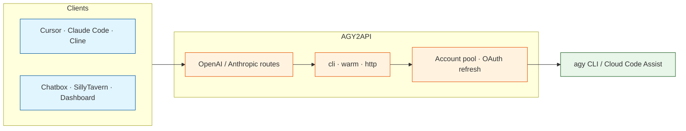

<div align="center">

# AGY2API

**OpenAI- and Anthropic-compatible API gateway for Google Antigravity (`agy`)**

English | [Tiếng Việt (Vietnamese)](doc/README_vi.md)

[](https://www.python.org/)
[](https://fastapi.tiangolo.com/)
[](https://www.docker.com/)
[](https://antigravity.google/product/antigravity-cli)
[](LICENSE)

</div>

> [!TIP]
> AGY2API bridges modern AI clients (Cursor, Claude Code, Cline, Chatbox) to your local Google Antigravity session.

> [!IMPORTANT]
> **Install and sign in to the [Google Antigravity (`agy`) CLI](https://antigravity.google/product/antigravity-cli) before running this API.**

> [!CAUTION]
> **Do not expose this API to the public internet.** It wraps a powerful local CLI. The included safety hook reduces risk but cannot guarantee protection against command injection.

Fork of [truongqv12/agy2api](https://github.com/truongqv12/agy2api) with account pool, Anthropic Messages API, warm/http transports, and OAuth refresh.

## Overview

Python FastAPI gateway that turns OpenAI- or Anthropic-shaped HTTP requests into Antigravity traffic — either via the `agy` CLI or direct Cloud Code Assist HTTP.

### Architecture



### Transport modes (`AGY_TRANSPORT`)

| Mode | Behavior |
| :--- | :--- |
| **`cli`** (default) | Fresh `agy` subprocess per request. Simple and correct; pays full process/auth startup each time. |
| **`warm`** | Session-sticky pool of live `agy` processes with token-level streaming. Continuing the same conversation reuses an authenticated process (~0.2s to first token vs ~10–15s cold). See `AGY_WARM_*` in `.env.example`. |
| **`http`** | Direct Cloud Code Assist HTTP (no `agy` agent tools / system prompt). Best when the **client** owns tools (e.g. Claude Code). Needs OAuth client env vars. Falls back to `warm` on errors. |

OAuth access tokens are refreshed via `oauth2.googleapis.com` before CLI calls and for `http` transport. Creds are read from `~/.gemini/oauth_creds.json` or `~/.gemini/antigravity-cli/antigravity-oauth-token`. Put `ANTIGRAVITY_CLIENT_ID` / `ANTIGRAVITY_CLIENT_SECRET` in **local** `.env` only — never commit them.

### Model aliases and force routing

- Alias `max-gem` → `gemini-3.7-flash-high` (`MODEL_ALIASES` in `app/core/model_manager.py`).
- `AGY_FORCE_MODEL=max-gem` sends **all** backend calls through one model (including Claude Code classifier traffic). Responses still echo the client’s original `model` name.

### Core capabilities

| Area | Capabilities |
| :-- | :-- |
| **APIs** | OpenAI Chat Completions, Images, Audio; Anthropic Messages (`/v1/messages`) |
| **Clients** | Cursor, Claude Code, Cline, Chatbox, SillyTavern |
| **Multimodal** | Images, OCR, PDFs, image-to-image via base64 data URIs |
| **Account pool** | Multi-account rotation, cooldown, optional private git sync, proxies |
| **Security** | PreToolUse hook (`scripts/safety_gate.py`) blocks dangerous shell commands |
| **Audio** | TTS via `/v1/audio/speech` ([capcut-tts-api](https://github.com/K07VN/capcut-tts-api)) |
| **Ops** | Web UI (keys, logs, stats, pool, requests), Docker, systemd |

## Quick start

### Prerequisites

- Python 3.8+ **or** Docker & Compose
- Working `agy` login on the host (or in the container’s user home)

### Method 1: Docker (recommended)

```bash
git clone https://github.com/makarworld/agy2api.git
cd agy2api
cp .env.example .env
# edit .env: set AGY_API_KEY and any OAuth / pool settings
docker compose up -d
docker compose logs -f
```

### Method 2: Local

```bash
git clone https://github.com/makarworld/agy2api.git
cd agy2api
python3 -m venv .venv
source .venv/bin/activate   # Windows: .venv\Scripts\activate
pip install -r requirements.txt
cp .env.example .env
# set AGY_API_KEY (and ANTIGRAVITY_CLIENT_* if using http transport)
uvicorn app.main:app --host 0.0.0.0 --port 8000
```

### Method 3: systemd (Linux)

1. Edit `agy-wrapper.service` (`WorkingDirectory`, `ExecStart`, `EnvironmentFile`).
2. Install and start:

```bash
mkdir -p ~/.config/systemd/user
cp agy-wrapper.service ~/.config/systemd/user/
systemctl --user daemon-reload
systemctl --user enable --now agy-wrapper
journalctl --user -u agy-wrapper -f
```

## Configuration (secrets stay local)

Copy `.env.example` → `.env`. Important variables:

| Variable | Purpose |
| :--- | :--- |
| `AGY_API_KEY` | Bearer key for OpenAI-compatible routes |
| `ANTHROPIC_COMPAT_API_KEY` | Optional key for Anthropic routes (falls back to `AGY_API_KEY`) |
| `AGY_TRANSPORT` | `cli` \| `warm` \| `http` |
| `ANTIGRAVITY_CLIENT_ID` / `ANTIGRAVITY_CLIENT_SECRET` | OAuth refresh (required for `http`) |
| `AGY_FORCE_MODEL` | Optional forced backend model / alias |
| `AGY_POOL_ENABLED` | Multi-account pool (default `false`) |

`.env`, OAuth token files under `~/.gemini/`, HAR captures, and pool credential stores must **never** be committed. Pool data defaults to `~/.agy2api-pool` (outside the repo).

## Safety hooks

Link or copy `.agents/hooks.json` to `~/.gemini/config/hooks.json` (or keep `.agents/hooks.json`) so `scripts/safety_gate.py` can block dangerous shell commands.

## API surface

**OpenAI-compatible**

- `GET /health`
- `GET /v1/models`
- `POST /v1/chat/completions`
- `POST /v1/images/generations`
- `POST /v1/audio/speech` · `GET /v1/audio/voices`
- `GET /api/keys` · `POST /api/keys`
- `GET /api/logs`

**Anthropic-compatible**

- `POST /v1/messages`
- `POST /v1/messages/count_tokens`

**Ops / pool / stats**

- `GET /v1/accounts` and related pool routes
- `GET /v1/stats/summary` · `timeseries` · `overview` · `chats` · `requests`

Full request/response shapes: [API_DOCS.md](API_DOCS.md).

## Cursor / Claude Code

**Cursor → Models**

1. Override OpenAI Base URL: `http://localhost:8000/v1`
2. API key = your `AGY_API_KEY`
3. Add custom model IDs (e.g. `gemini-3.7-flash-high` or alias `max-gem`)

**Claude Code**

Point Anthropic base URL at this server’s `/v1` and use `ANTHROPIC_COMPAT_API_KEY` (or `AGY_API_KEY`). Prefer `AGY_TRANSPORT=http` when Claude Code should own tool execution.

## Web UI

<p align="center">
  
</p>

`dist/` is not in git. Build once:

```bash
cd ui
npm install
npm run build
```

Restart the Python app — UI at `http://localhost:8000/`. For hot reload: `npm run dev`.

## Known limitations

- **Warm + account pool**: concurrent warm sessions on different accounts still share activation of `~/.gemini`; ideal fix is per-account `HOME` isolation (not implemented yet).

## License

MIT — see [LICENSE](LICENSE).
