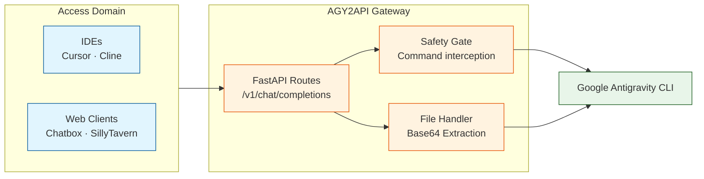

<div align="center">

# AGY2API

**A fully featured OpenAI-compatible API Wrapper for the Google Antigravity (AGY) CLI**

English | [Tiếng Việt (Vietnamese)](doc/README_vi.md)

[](https://www.python.org/)
[](https://fastapi.tiangolo.com/)
[](https://www.docker.com/)
[](https://antigravity.google/product/antigravity-cli)
[](LICENSE)

</div>

> [!TIP]
> AGY2API acts as a seamless bridge between modern AI clients (Cursor, Cline, Chatbox) and your local Google Antigravity instance.

> [!IMPORTANT]
> **You MUST install and configure the [Google Antigravity (`agy`) CLI](https://antigravity.google/product/antigravity-cli) before running this API.**

> [!CAUTION]
> **SECURITY WARNING:** Do NOT expose this API to the public internet. While `hooks.json` provides a basic safety gate, this project essentially acts as a wrapper around a powerful command-line interface. It cannot guarantee 100% protection against sophisticated command injection attacks that might compromise your server.

## Overview

AGY2API is a Python-based Gateway built with FastAPI. It translates OpenAI-compatible REST API requests into Google Antigravity (`agy`) commands, allowing you to use AGY's powerful agentic capabilities in any tool that supports OpenAI endpoints.

### Architecture



### Core capabilities

| Area | Capabilities |
| :-- | :-- |
| **APIs** | Fully compatible with OpenAI Chat Completions, Image Generation, and Audio Speech |
| **Clients** | Works flawlessly with Cursor, Cline, Chatbox, and SillyTavern |
| **Multimodal & Vision** | Read and analyze images, perform OCR on documents/PDFs, and support image-to-image generation |
| **File Handling** | Automatically extracts base64 files from requests, writes them to a managed temp directory, and passes them to AGY |
| **Security** | Implements an AGY PreToolUse hook (`safety_gate.py`) to intercept and block dangerous shell commands |
| **Audio** | Text-to-speech generation via `/v1/audio/speech` (Powered by [capcut-tts-api](https://github.com/K07VN/capcut-tts-api)) |
| **Operations** | Integrated web UI for managing API keys and viewing logs, Daemon Mode (Docker & Systemd) |

## 🚀 Quick Start

### Prerequisites
- Python 3.8+ or Docker & Docker Compose

### Method 1: Docker Deployment (Recommended)

```bash
# Clone the repository
git clone https://github.com/truongqv12/agy2api.git
cd agy2api

# Copy example environment file (and then edit it with your secret key)
cp .env.example .env

# Start the service (use 'docker-compose' for older Docker versions)
docker compose up -d

# View logs
docker compose logs -f
```

### Method 2: Local Deployment

```bash
# Clone the repository
git clone https://github.com/truongqv12/agy2api.git
cd agy2api

# Create and activate virtual environment (On Mac/Linux use python3)
python3 -m venv .venv
source .venv/bin/activate  # On Windows use `.venv\Scripts\activate`

# Install dependencies
pip install -r requirements.txt

# Copy and configure your API key
cp .env.example .env
export AGY_API_KEY="your-secret-key"

# Start the service
uvicorn app.main:app --host 0.0.0.0 --port 8000
```

### Method 3: Systemd Service (Linux only)

For a robust background service on Linux, you can use `systemd`. We have provided an `agy-wrapper.service` file for this purpose.

1. Open `agy-wrapper.service` and update the `WorkingDirectory`, `ExecStart`, and `EnvironmentFile` paths if your project is not located at `/home/truong/agy2api`.
2. Copy the service file to your systemd user directory:
   ```bash
   mkdir -p ~/.config/systemd/user
   cp agy-wrapper.service ~/.config/systemd/user/
   ```
3. Reload systemd and enable the service:
   ```bash
   systemctl --user daemon-reload
   systemctl --user enable --now agy-wrapper
   ```
4. View logs:
   ```bash
   journalctl --user -u agy-wrapper -f
   ```

## 🛡️ Safety Hooks

To enable the safety gate in your local `agy` environment, link or copy `hooks.json` to your `~/.gemini/config/hooks.json` or `.agents/hooks.json`.

## 🔌 API Endpoints
- `GET /health`
- `GET /v1/models`
- `POST /v1/chat/completions`
- `POST /v1/images/generations`
- `POST /v1/audio/speech`
- `GET /v1/audio/voices`
- `GET /api/keys` / `POST /api/keys`
- `GET /api/logs`

For a complete guide, please refer to the [API Documentation](API_DOCS.md).

## ⚙️ Usage with Cursor

In **Cursor Settings > Models**:
1. Override OpenAI API Base URL with `http://localhost:8000/v1`
2. Enter your `AGY_API_KEY`.
3. Add custom model names (e.g., `Gemini 3.6 Flash (High)`).

## 🎨 Developing the UI (Optional)

<p align="center">
  
</p>

If you chose **Method 2 (Local Deployment)** and want to access the Web UI, you must build it manually since the compiled `dist` folder is not included in the repository.

```bash
cd ui
npm install
npm run build
```
Once built, restart your Python server and the UI will be available at `http://localhost:8000/`. Alternatively, you can run `npm run dev` to start a Vite development server with hot-reloading.

