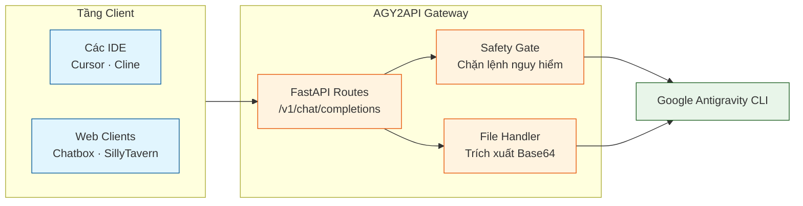
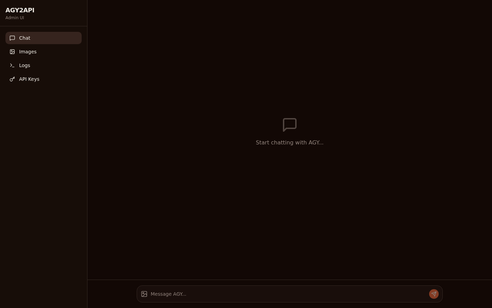

<div align="center">

# AGY2API

**Một dịch vụ API tương thích hoàn toàn với OpenAI, đóng vai trò là Wrapper cho Google Antigravity (AGY) CLI**

[English](../README.md) | Tiếng Việt

[](https://www.python.org/)
[](https://fastapi.tiangolo.com/)
[](https://www.docker.com/)
[](https://antigravity.google/product/antigravity-cli)
[](../LICENSE)

</div>

> [!TIP]
> AGY2API hoạt động như một cầu nối mượt mà giữa các AI client hiện đại (Cursor, Cline, Chatbox) và Google Antigravity CLI nội bộ của bạn.

> [!IMPORTANT]
> **BẠN BẮT BUỘC PHẢI cài đặt và cấu hình [Google Antigravity (`agy`) CLI](https://antigravity.google/product/antigravity-cli) trước khi chạy API này.**

## Tổng quan

AGY2API là một API Gateway viết bằng Python kết hợp với FastAPI. Nhiệm vụ của nó là biên dịch các yêu cầu REST API chuẩn OpenAI thành các lệnh gọi Google Antigravity (`agy`), giúp bạn mang sức mạnh tự động hóa của AGY vào bất kỳ công cụ nào có hỗ trợ kết nối qua OpenAI API.

### Kiến trúc (Architecture)



### Các tính năng cốt lõi

| Hạng mục | Tính năng |
| :-- | :-- |
| **APIs** | Tương thích hoàn toàn với OpenAI Chat Completions, Image Generation, và Audio Speech |
| **Clients** | Hoạt động trơn tru với Cursor, Cline, Chatbox, và SillyTavern |
| **Đa phương thức (Multimodal)** | Tự động trích xuất file và hình ảnh base64, lưu vào thư mục tạm và truyền sang AGY |
| **Bảo mật** | Tích hợp hook AGY PreToolUse (`safety_gate.py`) giúp phân tích và chặn các lệnh shell nguy hiểm |
| **Âm thanh** | Hỗ trợ Text-to-Speech (TTS) thông qua `/v1/audio/speech` (Dựa trên mã nguồn [capcut-tts-api](https://github.com/K07VN/capcut-tts-api)) |
| **Vận hành** | Có sẵn giao diện Web UI để quản lý API keys, xem logs, hỗ trợ chạy nền qua Docker hoặc Systemd |

## 🚀 Hướng dẫn Nhanh

### Yêu cầu
- Python 3.8+ hoặc Docker & Docker Compose

### Cách 1: Triển khai với Docker (Khuyên dùng)

```bash
# Clone dự án
git clone https://github.com/truongqv12/agy2api.git
cd agy2api

# Copy file biến môi trường mẫu (sau đó bạn cần sửa lại key)
cp .env.example .env

# Khởi chạy dịch vụ (sử dụng 'docker compose' cho Docker bản mới trên Mac/Linux)
docker compose up -d

# Xem log
docker compose logs -f
```

### Cách 2: Triển khai Local (Môi trường ảo)

```bash
# Clone dự án
git clone https://github.com/truongqv12/agy2api.git
cd agy2api

# Tạo và kích hoạt môi trường ảo (venv) (Trên Mac/Linux khuyên dùng python3)
python3 -m venv .venv
source .venv/bin/activate  # Trên Windows dùng `.venv\Scripts\activate`

# Cài đặt thư viện
pip install -r requirements.txt

# Copy và cấu hình API Key
cp .env.example .env
export AGY_API_KEY="your-secret-key"

# Khởi chạy dịch vụ
uvicorn app.main:app --host 0.0.0.0 --port 8000
```

### Triển khai bằng Systemd
1. Copy file `agy-wrapper.service` vào thư mục `~/.config/systemd/user/`.
2. Chỉnh sửa đường dẫn trong file service cho phù hợp.
3. Chạy lệnh `systemctl --user daemon-reload`
4. Chạy lệnh `systemctl --user enable --now agy-wrapper`

## 🛡️ Hook An toàn (Safety Hooks)

Để bật chế độ bảo vệ (safety gate) cho môi trường `agy` ở local, bạn hãy link hoặc copy file `hooks.json` vào `~/.gemini/config/hooks.json` hoặc `.agents/hooks.json`.

## 🔌 Các Endpoint Chính
- `GET /health`
- `GET /v1/models`
- `POST /v1/chat/completions`
- `POST /v1/images/generations`
- `POST /v1/audio/speech`
- `GET /v1/audio/voices`
- `GET /api/keys` / `POST /api/keys`
- `GET /api/logs`

Để xem hướng dẫn chi tiết, vui lòng đọc [Tài liệu API](../API_DOCS.md).

## ⚙️ Sử dụng với Cursor

Trong phần **Cursor Settings > Models**:
1. Ghi đè (Override) trường OpenAI API Base URL thành `http://localhost:8000/v1`
2. Nhập `AGY_API_KEY` của bạn.
3. Thêm tên model tuỳ chỉnh (Ví dụ: `Gemini 3.6 Flash (High)`).

## 🎨 Phát triển Giao diện UI (Tuỳ chọn)

<p align="center">
  
</p>

Nếu bạn chọn **Cách 2 (Triển khai Local)** và muốn sử dụng giao diện Web, bạn cần tự biên dịch (build) UI vì thư mục `dist` không được lưu trên GitHub.

```bash
cd ui
npm install
npm run build
```
Sau khi chạy xong, hãy khởi động lại server Python, giao diện sẽ xuất hiện tại `http://localhost:8000/`. Ngoài ra, bạn cũng có thể chạy lệnh `npm run dev` để bật môi trường phát triển Vite với tính năng cập nhật theo thời gian thực (hot-reload).
